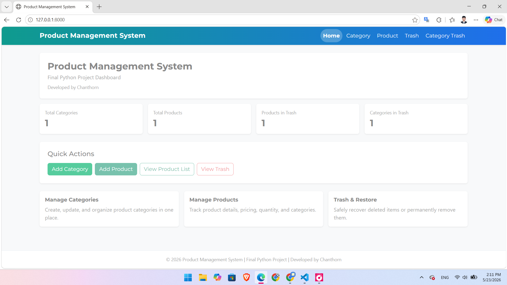
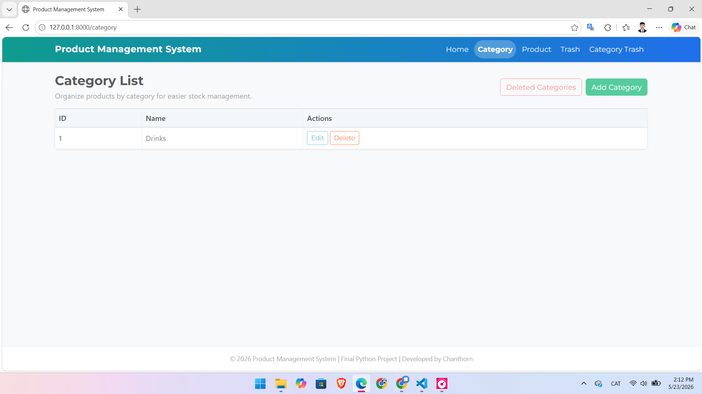
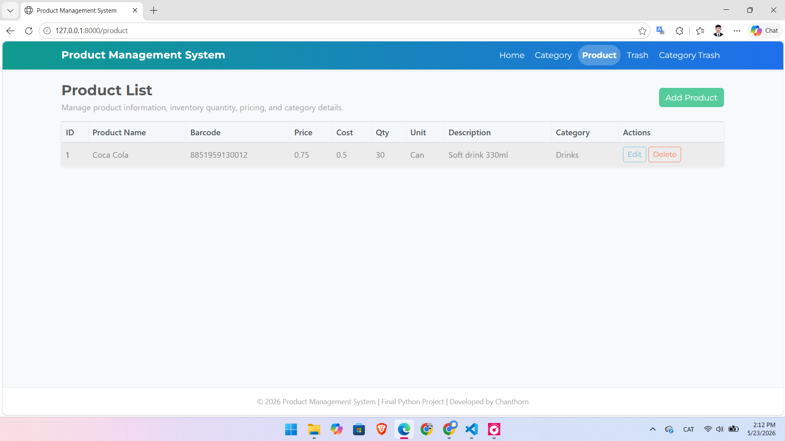
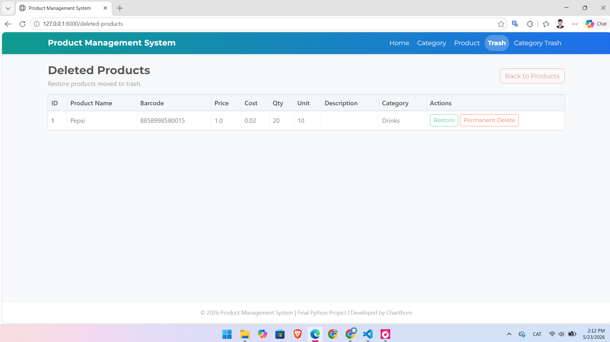
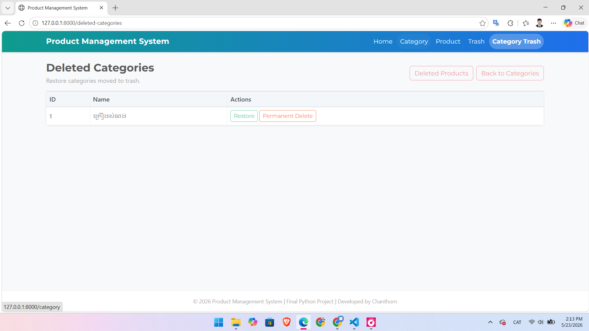

# Product Management System

## Project Overview
Product Management System គឺជា Web Application ដែលបានបង្កើតឡើងសម្រាប់ Final Python Project។ Project នេះប្រើ Django Framework និង SQLite Database សម្រាប់គ្រប់គ្រង Category និង Product។ ប្រព័ន្ធនេះមាន CRUD operations ដូចជា Create, Read, Update, Delete ព្រមទាំងមាន Trash, Restore និង Permanent Delete ដើម្បីការពារការលុបទិន្នន័យខុស។

## Key Features
- Dashboard បង្ហាញចំនួនសរុបរបស់ Category, Product, Product Trash និង Category Trash
- Category Management: Add, Edit, List, Soft Delete, Restore, Permanent Delete
- Product Management: Add, Edit, List, Soft Delete, Restore, Permanent Delete
- Trash System សម្រាប់រក្សាទុកទិន្នន័យដែលបានលុប
- Responsive UI សម្រាប់ Desktop និង Mobile
- Clean UI ដោយប្រើ Bootstrap

## Technologies Used
- Python
- Django
- SQLite
- HTML
- CSS
- Bootstrap
- Git & GitHub

## Screenshots
### Home Dashboard


### Category List


### Product List


### Add Product


### Edit Product


## Installation
```bash
git clone https://github.com/pichchanthorn/product-management-system.git
cd product-management-system
python -m venv .venv
```

## How to Run
```bash
python manage.py makemigrations
python manage.py migrate
python manage.py runserver
```

## Usage
- បើក Browser ហើយចូលទៅកាន់ http://127.0.0.1:8000/
- ប្រើ Dashboard ដើម្បីមើលស្ថិតិសរុប
- គ្រប់គ្រង Category និង Product តាម CRUD
- ប្រើ Trash, Restore និង Permanent Delete ដើម្បីគ្រប់គ្រងទិន្នន័យដែលបានលុប

## Project Structure
```
blog_project/
  blog_app/
    migrations/
    templates/
  blog_project/
  static/
  db.sqlite3
  manage.py
```

## Future Improvements
- Add search និង filter សម្រាប់ Category និង Product
- Add pagination សម្រាប់តារាងទិន្នន័យ
- Add role-based access (Admin/User)

## Author
Developed by Chanthorn

## License
This project is for educational purposes.
